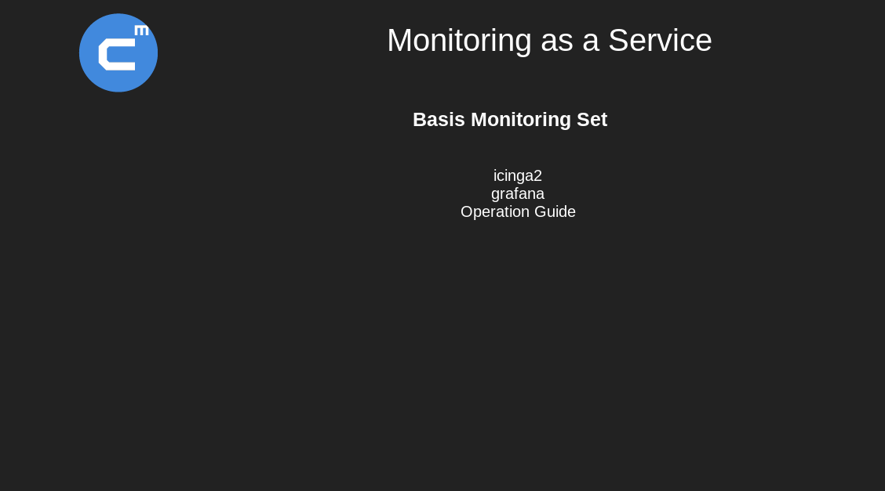

# CoreMedia Monitoring Toolbox

## Einleitung

Das CoreMedia Monitoring basiert auf einem Set von mehreren Dockercontainern, welche die genutzten Services kappseln.

Der Einstaz von Docker ist nicht zwingend notwendig, wird aber in diesem Kontext genutzt um eine dynamische Entwicklung zu fördern.

Ziel ist ein funktionierendes Monitoring-System, welches auf jedem System ausgerollt werden kann.

Dokumentation ist ein bekannter Schwachpunkt, an denen wir aber arbeiten.

----

## Schnelleinstieg

In diesem kurzen Kapitel geht es darum einen Monitoring-Stack in möglichst kurzer Zeit zu starten.

Als Basissystem dient ein Linux (Debian/CentOS). MacOS bzw. Windows sollten ähnlich sein.

### Installation

#### Docker-Engine

**Debian**

    apt-get remove \
      docker \
      docker-engine

    apt-get install \
      apt-transport-https \
      ca-certificates \
      curl \
      python-software-properties

    curl -fsSL https://download.docker.com/linux/debian/gpg | sudo apt-key add -

    add-apt-repository \
      "deb [arch=amd64] https://download.docker.com/linux/debian \
      $(lsb_release -cs) \
      stable"

    apt-get update

    apt-get install docker-ce

**CentOS**

    yum remove \
      docker \
      docker-common \
      container-selinux \
      docker-selinux \
      docker-engine

    yum install -y \
      yum-utils

    yum-config-manager \
      --add-repo \
      https://download.docker.com/linux/centos/docker-ce.repo

    yum makecache \
      fast

    yum install \
      docker-ce

#### Docker-Compose

Neben dem eigentlichen `docker` benötigen wir noch das `docker-compose` binary, welches uns eine einfach Möglichkeit bietet, viele Container einfach zu orchestrieren.

    COMPOSE_VERSION="1.13.0"
    URL="https://github.com/docker/compose/releases/download/${COMPOSE_VERSION}/docker-compose-$(uname -s)-$(uname -m)"

    curl -L ${URL} > /usr/bin/docker-compose_${COMPOSE_VERSION}

    ln -s /usr/bin/docker-compose_${COMPOSE_VERSION} /usr/bin/docker-compose

### Post-Installation (optional)

Wenn ein spezieller User `docker` benutzen soll, benötigen wir noch eine entsprechende Gruppe und fügen diesen User dier Gruppe hinzu:

    groupadd docker

    usermod -aG docker $USER

Damit wäre die Basisvoraussetzung erfüllt.

Jetzt benötigen wir noch die

### Monitoring-Toolbox

    cd ~
    mkdir cm-monitoring-toolbox
    cd cm-monitoring-toolbox

    git clone https://github.com/cm-xlabs/monitoring.git

Nach dem erfolgreichen clonen sollte ungefähr diese Verzeichnissstruktur vorhanden sein:

      monitoring
        ├── bin
        ├── docker-cm-carbon-client
        ├── docker-cm-data
        ├── docker-cm-data-collector
        ├── docker-cm-external-discover
        ├── docker-cm-grafana-client
        ├── docker-cm-graphite-client
        ├── docker-cm-icinga-client
        ├── docker-cm-rest-service
        ├── docker-cm-service-discovery
        ├── documentation
        ├── environments
        │    ├── aio
        │    │    ├── docker-compose.yml
        │    │    └── environments.yml
        │    ├── data-capture
        │    └── data-visualization
        │
        ├── incubator
        ├── praese
        └── tools

Alle Verzeichnisse, die mit `docker-cm` beginnen, beinhalten die komplette CoreMedia Logik bezüglich des Monitorings, oder sind spezielle Clients für OpenSource Komponenten.
Im Verzeichniss `environments` befinden sich 3 verschieden Monitoringumgebungen:

  * `aio` (All-In-One) - beinhaltet die komplette Toolbox. Dies ist die Basis für diesen Schnelleinstieg.
  * `data-capture` - beinhaltet alle Services um Daten zu erfassen und an externe Services weiterzuleiten. In unserem Fall wäre es
  * `data-visualization` - beinhaltet alle Services um Monitoringdaten darzustellen.

### erster Start

Vor dem ersten Start müssen wir in das gewünschte Environment wechseln

    cd ~/cm-monitoring-toolbox/monitoring/environments/aio
    ls -1
      docker-compose.yml
      environments.yml
      Makefile

Die Datei `docker-compose.yml` umfasst alle Docker-Container, die der Stack bereitstellen wird. In `environments.yml` ist die komplette Konfiguration zusammen gefasst.
Beide Dateien muss man nicht ändern, sie laufen _out-of-the-box_.

Die Monitoring-Toolbox lässt sich jetzt mit einem einfachen `docker-compose up --build -d` starten.

Wenn der build und der start abgeschlossen sind, kann man das Ergebniss kurz validieren

    docker-compose ps

           Name                      Command               State                                            Ports
    ------------------------------------------------------------------------------------------------------------------------------------------------------
    01-data               /bin/sh -c "/init/run.sh"  ...   Exit 0
    beanstalkd            /usr/bin/beanstalkd -b /va ...   Up       11300/tcp
    carbon                /init/run.sh                     Up       0.0.0.0:2003->2003/tcp, 0.0.0.0:2003->2003/udp, 2004/tcp, 7002/tcp, 7007/tcp, 8080/tcp
    cm-carbon-client      /usr/local/bin/carbon-data.rb    Up
    cm-data-collector     /usr/local/bin/data-collec ...   Up
    cm-grafana-client     /usr/local/bin/grafana-cli ...   Up
    cm-graphite-client    /usr/local/bin/graphite-cl ...   Up
    cm-icinga-client      /usr/local/bin/icinga-clie ...   Up
    cm-rest-service       /init/run.sh                     Up
    cm-service-discover   /usr/local/bin/service-dis ...   Up
    database              /init/run.sh                     Up       3306/tcp
    dnsdock               /usr/bin/dnsdock --nameser ...   Up       53/tcp, 53/udp, 80/tcp
    grafana               /init/run.sh                     Up       3000/tcp
    graphite              /init/run.sh                     Up       2003/tcp, 2003/udp, 7002/tcp, 8080/tcp
    icinga2-master        /init/run.sh                     Up       0.0.0.0:5665->5665/tcp, 0.0.0.0:6666->6666/tcp
    icingaweb2            /init/run.sh                     Up       80/tcp
    jolokia               /init/run.sh                     Up       8080/tcp
    markdown-service      /srv/ruby-markdown-service ...   Up       2222/tcp
    memcached             /usr/bin/memcached -l 0.0. ...   Up       11211/tcp
    nginx                 /usr/sbin/nginx                  Up       443/tcp, 0.0.0.0:80->80/tcp
    redis                 /usr/bin/redis-server /etc ...   Up       6379/tcp

Dabei werden alle Abhängigkeiten aus dem Internet geladen (das betrifft alle OpenSource Container, die bereits vorab gebaut wurden und auf `https://hub.docker.com` zum Download vorliegen)
und die CoreMedia Container werden anschließend gebaut. Beim ersten Start kann dies bis zu 5 Minuten dauern. Abhängig von der Internetanbindung und der Hardwareausstattung.

Nach dem erfolgreichem Start steht das Webinterface der Toolbox unter `http://localhost` zur Verfügung:

### Hinzufügen eine CoreMedia Node

Unsere Monitoring-Toolbox stellt ein einfaches REST-Interface zur Verfügung, über das eine Node einfach hinzugefügt werden kann:

    COREMEDIA_HOST="cm-foo-cms"
    curl --request POST http://localhost/api/v2/host/${COREMEDIA_HOST}

----

Zu den einzelnen Punkten gibt es mehr Dokumentation:

 - [Installation](documentation/installation.md)
 - [API](documentation/api.md)
 - [docker-compose](documentation/first-start.md)

[Dokumentation](./documentation/README.md)
