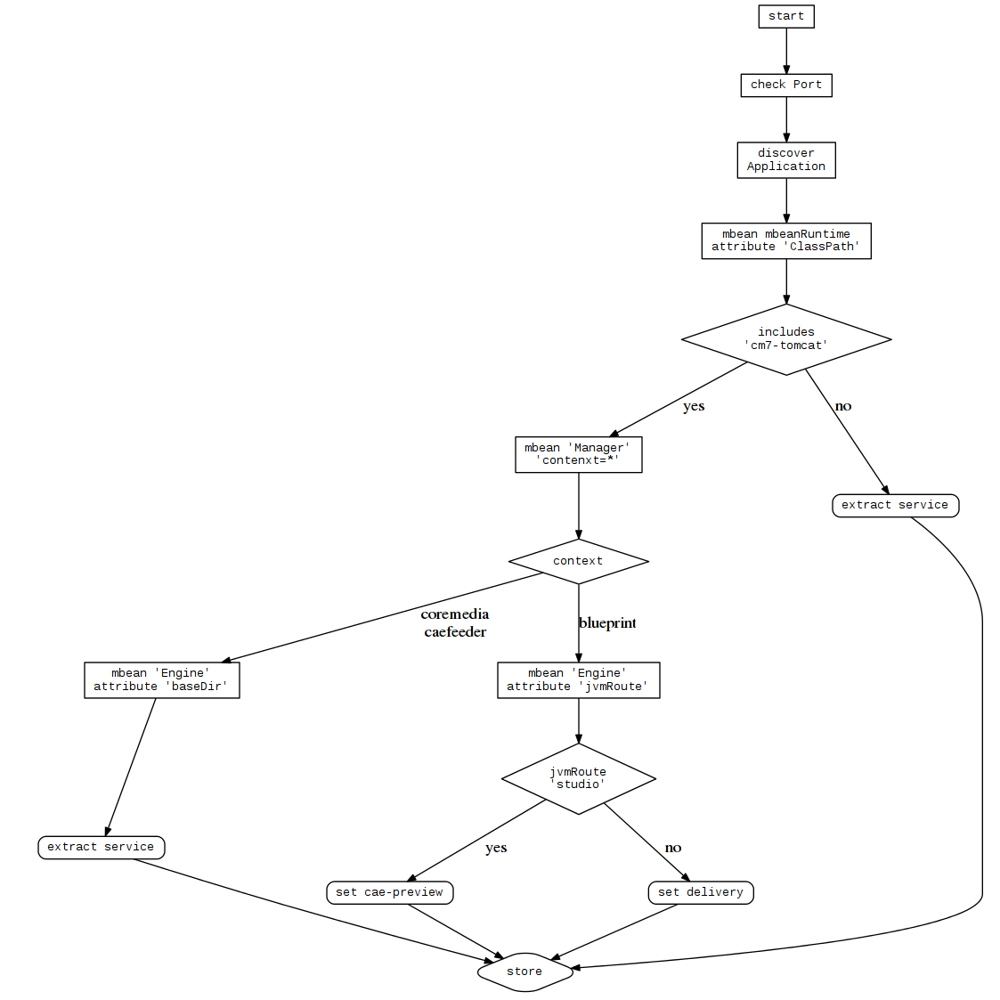

# Service Discovery

Our Service Discovery is a little Score game.

In older Version, we can deploy many Applications on one Servlet-Container.

The JMX Result are different.

And (the worst case) any Customer can be change the Application names.

## Overview



# request to get data

example data to send to jolokia. A bulk-request for 3 different mbeans.

```
[
  {
    "type": "read",
    "mbean": "java.lang:type=Runtime",
    "attribute": [
      "ClassPath"
    ],
    "target": {
      "url": "service:jmx:rmi:///jndi/rmi://monitoring-16-01:42199/jmxrmi"
    }
  },
  {
    "type": "read",
    "mbean": "Catalina:type=Manager,context=*,host=*",
    "target": {
      "url": "service:jmx:rmi:///jndi/rmi://monitoring-16-01:42199/jmxrmi"
    }
  },
  {
    "type": "read",
    "mbean": "Catalina:type=Engine",
    "attribute": [
      "baseDir",
      "jvmRoute"
    ],
    "target": {
      "url": "service:jmx:rmi:///jndi/rmi://monitoring-16-01:42199/jmxrmi"
    }
  }
]
```

Since Version 1707, we integrate a seperate and read-only bean to help us the secure application detection.
this bean is defined in the pom.xml and set the application name to build time.


# results

## 7.0

*Old Version*

```
[
  {
    "request": {
      "mbean": "java.lang:type=Runtime",
      "attribute": "ClassPath",
      "type": "read",
      "target": {
        "url": "service:jmx:rmi:///jndi/rmi://192.168.252.170.xip.io:40099/jmxrmi"
      }
    },
    "value": {
      "ClassPath": "/opt/coremedia/cm7-tomcat-installation/bin/bootstrap.jar:/opt/coremedia/cm7-tomcat-installation/bin/tomcat-juli.jar"
    },
    "timestamp": 1483716539,
    "status": 200
  },
  {
    "request": {
      "mbean": "Catalina:context=*,host=*,type=Manager",
      "type": "read",
      "target": {
        "url": "service:jmx:rmi:///jndi/rmi://192.168.252.170.xip.io:40099/jmxrmi"
      }
    },
    "value": {
      "Catalina:context=/blueprint,host=localhost,type=Manager": {

      },
      "Catalina:context=/manager,host=localhost,type=Manager": {

      },
      "Catalina:context=/editor-webstart,host=localhost,type=Manager": {

      },
      "Catalina:context=/webdav,host=localhost,type=Manager": {

      },
      "Catalina:context=/studio,host=localhost,type=Manager": {

      },
      "Catalina:context=/elastic-worker,host=localhost,type=Manager": {

      }
    },
    "timestamp": 1483716539,
    "status": 200
  },
  {
    "request": {
      "mbean": "Catalina:type=Engine",
      "attribute": [
        "baseDir",
        "jvmRoute"
      ],
      "type": "read",
      "target": {
        "url": "service:jmx:rmi:///jndi/rmi://192.168.252.170.xip.io:40099/jmxrmi"
      }
    },
    "value": {
      "baseDir": "/opt/coremedia/cm7-studio-tomcat",
      "jvmRoute": "studioWorker"
    },
    "timestamp": 1483716539,
    "status": 200
  }
]
```
In the first block (```"mbean": "java.lang:type=Runtime"```) we look at the ```"ClassPath"``` Variable.
contains the result ```cm7-tomcat-installation``` we have an old portstyle and an 7.0 Version.

Then, we look at the second Block(```"mbean": "Catalina:context=*,host=*,type=Manager"```) and use the ```"value"``` Part.

Every deployed Application has his own ```Catalina:context``` Entry.

In the Example above, we found following

- blueprint
- manager
- editor-webstart
- webdav
- studio
- elastic-worker

In the third block (```"mbean": "Catalina:type=Engine"```) we analized both attributes ```baseDir``` and ```jvmRoute```.

Contains ```baseDir``` ```coremedia``` or ```caefeeder``` we extract the Application from the Path Name.

Contains ```baseDir``` ```blueprint```, we extract the Application from the ```jvmRoute```.

Contains ```jvmRoute``` ```studio``` then we think, it is a ```cae-preview```, otherwise it is a ```delivery-cae```

The ```manager``` entry will complete ignored.
The found application names are finally normalized.


## 7.1

## 7.5

## 17xx

```
[
  {
    "request": {
      "mbean": "java.lang:type=Runtime",
      "attribute": "ClassPath",
      "type": "read",
      "target": {
        "url": "service:jmx:rmi:///jndi/rmi://monitoring-16-01:42199/jmxrmi"
      }
    },
    "value": {
      "ClassPath": "/opt/coremedia/cae-live-1/current/bin/bootstrap.jar:/opt/coremedia/cae-live-1/current/bin/tomcat-juli.jar"
    },
    "timestamp": 1483365782,
    "status": 200
  },
  {
    "request": {
      "mbean": "Catalina:context=*,host=*,type=Manager",
      "type": "read",
      "target": {
        "url": "service:jmx:rmi:///jndi/rmi://monitoring-16-01:42199/jmxrmi"
      }
    },
    "value": {
      "Catalina:context=/blueprint,host=localhost,type=Manager": {

      }
    },
    "timestamp": 1483365782,
    "status": 200
  },
  {
    "request": {
      "mbean": "Catalina:type=Engine",
      "attribute": [
        "baseDir",
        "jvmRoute"
      ],
      "type": "read",
      "target": {
        "url": "service:jmx:rmi:///jndi/rmi://monitoring-16-01:42199/jmxrmi"
      }
    },
    "value": {
      "baseDir": "/opt/coremedia/cae-live-1/current",
      "jvmRoute": "cae-live-1"
    },
    "timestamp": 1483365782,
    "status": 200
  }
]

```

In the first block (```"mbean": "java.lang:type=Runtime"```) we look at the ```"ClassPath"``` Variable.
Contains the result **NOT** ```cm7-tomcat-installation``` we have an new portstyle and can extract the Application Name from ```ClassPath```.

Multiple Applications in one Tomcat will be ignored.


