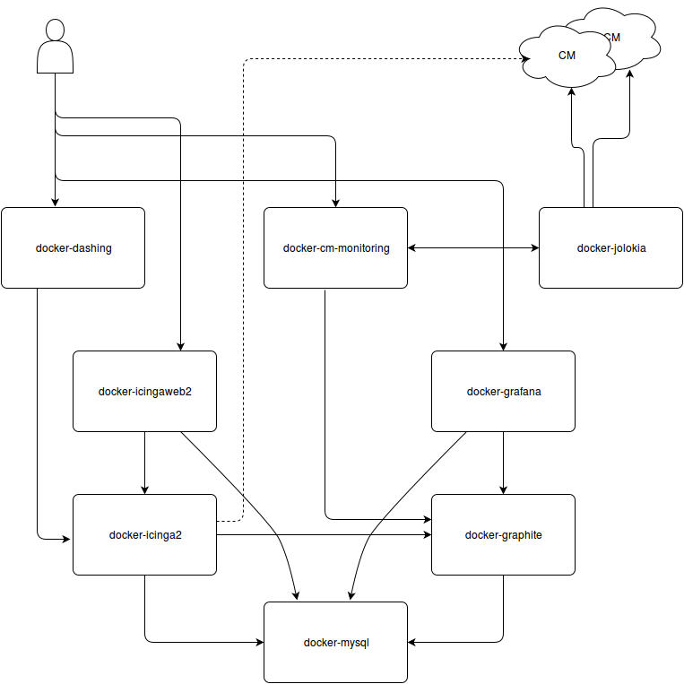

# Monitoring

Das ist ein Meta-Verzeichniss, welches mehrere - durchaus voneinander abhängige - Dockercontainer enthält.

Ziel ist ein funktionierendes Monitoring-System, welches auf jedem System ausgerollt werden kann. 

Das System ist so modular wie möglich aufgebaut, allerdings momentan noch in einem Proof-of-Concept Status.

## Status

Work-in-Progress

## Inhalt

 - docker-cm-monitoring
 - docker-dashing
 - docker-grafana
 - docker-graphite
 - docker-icinga2
 - docker-icingaweb2
 - docker-jolokia
 - docker-mysql

### cocker-cm-monitoring

Beinhaltet alle Coremediaspezifika. Vor allem Scripte für Icinga, Grafana und Jolokia.

In dem Container wird der zu monitorende Host in das System eingefügt.
Er sollte generell als letzter Container gestartet werden und in einer `screen` Session laufen, da nach dem beenden dieses Containers alle darin laufenden Jobs beendet werden.

### docker-dashing

[Dashing](http://dashing.io/) ist ein einfaches Dashing-Framework, welches über [Widgets](https://github.com/Shopify/dashing/wiki/Additional-Widgets) erweitert werden kann.

Das Dashing-Framework kann von verschiedenen Services Daten einsammeln und visualisieren.

Zur Zeit stehen für Coremedia folgende Widgets / Jobs zur Verfügung;
 - pingdom
 - chef-nodes
 - cloud formation
 - cloud watch
 - jenkins
 - icinga2

### docker-grafana

[Grafana](http://grafana.org/) ist ein Web-UI um Grafen in Echtzeit darstellen zu können.

Es können verschiedene Storage-Backends ([graphite](http://graphite.readthedocs.org/en/latest/), [influxdb](https://influxdata.com/), [Elasticsearch](https://www.elastic.co/products/elasticsearch), [Cloudwatch](https://aws.amazon.com/de/cloudwatch/), [Prometeus](https://prometheus.io/), [OpenTSDB](http://opentsdb.net/) ) benutzt werden.

In diesem Meta-Package wird ausschließlich graphite genutzt.

### docker-graphite

Graphite ist das hier genutzte Storage-Backend für Grafana.

### docker-icinga2

[Icinga2](https://www.icinga.org/products/icinga-2/) ist der Monitoring-Host, welches Host- und Servicechecks ausführt.

### docker-icingaweb2

Das [Webfrontend](https://www.icinga.org/products/screenshots/icinga-web-2/) für Icinga2

### docker-jolokia

jmx2json Bridge.
Mit [jolokia](https://jolokia.org/) hat man die Möglichkeiten, die MBeans eines Tomcats über JMX abzufragen und die Ergebnisse in json lesbar zu bekommen.

### docker-mysql

Storage-Backend für Icinga2, Graphite, Grafana.

## Kommunikation & Beziehungen

Die Storage-Engines (mysql und graphite) sollten jeweils als erstes gestartet werden.
Die jeweiligen Frontends prüfen die Erreichbarkeit ihrer Backends und starten ggf. zeitversetzt. 

**Portüberschneidungen müssen beim Start der Dockercontainer berücksichtigt werden!**

### Ports
 - docker-mysql
      - serving: port 3306
      - use: lokales Filesystem für persistente Daten
 - docker-dashing
      - serving: 3030 (http://localhost:3030)
      - use: docker-icinga2: 5665
 - docker-grafana
      - serving: 3000 (http://localhost:3000)
      - use: docker-mysql: 3306
      - use: docker-graphite: 8080
 - docker-graphite
      - serving: 8080 (http://localhost:8080)
      - serving: 2003
      - serving: 7002
      - use: docker-mysql: 3306
      - use: lokales Filesystem 
 - docker-icinga2
      - serving: 5665
      - serving: 6666
      - use: docker-mysql: 3306
      - use: lokales Filesystem 
 - docker-icingaweb2
      - serving: 80 (http://localhost/icinga)
      - use: docker-mysql: 3306
      - use: Filesystem von docker-icinga2
 - docker-jolokia
      - serving: 8080 (http://localhost:8080/jolokia)

## langfristiges Ziel

Die Idee für ein langfristiges Ziel wäre ein sich selbst konfigurierendes Monitoringsystem.
Hier könnte der Einsatz von [consul](https://www.consul.io/) ein wichtige Schritt sein.

## Schematischer Aufbau

## Nutzung

Mit Hilfe des Scriptes `build-all.sh` kann man alle nötigen Container bauen lassen. Das sollte nur dann nötig sein, wenn sich die Dockerfiles oder der Inhalt das Verzeichnisses rootfs geändert hat.

Ein kompletter Build dauert ca. 18 Minuten, da Teile davon direkt aus ihren Sourcen gebaut werden. (grafana ist da mit Abstand der größte Zeitfresser)

Durch `run-monitoring.sh` werden alle Container für das Monitoring System gestartet. Ausgenommen der Container `docker-cm-monitoring`, dieser sollte in einer screen Session gestartet werden.

    screen -S cm-mon
    cd docker-cm-monitoring
    ./build.sh && ./run.sh

Nach dem erfolgreichen Start, kann über die Kommandozeile der zu monitende Host hinzugefügt werden:

    add-host --host $name 

Das Script versicht ein auto-discovery durchzuführen um festzustellen, welche Anwendung auf den jeweiligen Port läuft und fügt anschließend Standardtemplates für grafana und icinga2 hinzu.

   

 